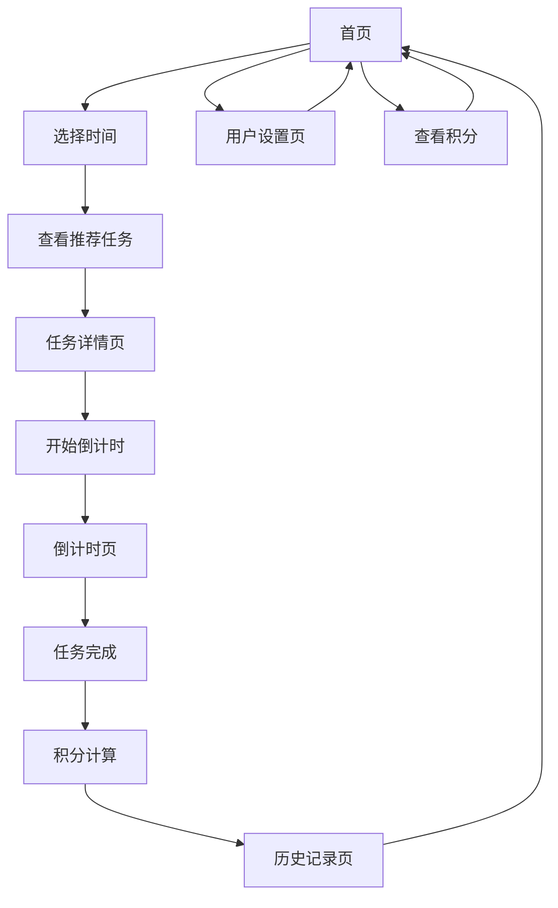

# 碎片时间管理器 - 产品需求文档

## 1. 产品概述
碎片时间管理器是一款智能时间管理应用，帮助用户充分利用120分钟以内的碎片时间。
通过精确的时间匹配系统，为用户推荐最适合的定时任务，提升时间利用效率和个人成长。
产品为注册用户提供积分激励系统，完成任务可获得积分奖励（每分钟1积分），激发持续使用动力。
产品旨在解决现代人碎片时间浪费问题，让每一分钟都变得有价值。

## 2. 核心功能

### 2.1 用户角色
| 角色 | 注册方式 | 核心权限 |
|------|----------|----------|
| 普通用户 | 邮箱注册 | 可选择时间、查看推荐任务、使用倒计时功能、积分系统、数据云端同步 |
| 游客模式 | 无需注册 | 可选择时间、查看推荐任务、使用倒计时功能、本地数据存储 |

### 2.2 功能模块
我们的碎片时间管理器包含以下主要页面：
1. **首页**：时间选择器、任务推荐展示、快速开始按钮、积分显示（仅注册用户）
2. **任务详情页**：任务详细信息、开始倒计时按钮、任务说明、预期积分显示（仅注册用户）
3. **倒计时页**：倒计时显示、暂停/继续控制、完成确认、实时积分计算（仅注册用户）
4. **历史记录页**：已完成任务记录、时间统计、积分统计（仅注册用户）、成就展示
5. **用户设置页**：个人偏好设置、任务类型偏好、通知设置、积分总览（仅注册用户）

### 2.3 页面详情
| 页面名称 | 模块名称 | 功能描述 |
|----------|----------|----------|
| 首页 | 时间选择器 | 提供滑动条或数字输入，选择1-120分钟的时间段 |
| 首页 | 任务推荐区域 | 根据选择时间精确匹配对应时长的任务，显示任务类型、完成时间、难度等级、分类标签、预期积分（仅注册用户） |
| 首页 | 快速开始 | 一键开始推荐任务的按钮，支持任务预览 |
| 首页 | 积分显示 | 在页面顶部显示用户当前总积分，支持点击查看积分详情（仅注册用户） |
| 任务详情页 | 任务信息展示 | 显示任务标题、详细描述、精确完成时间、完成步骤、预期获得积分（仅注册用户） |
| 任务详情页 | 开始按钮 | 确认开始任务，跳转到倒计时页面 |
| 倒计时页 | 倒计时显示 | 大字体显示剩余时间，直接使用任务的精确时长进行倒计时 |
| 倒计时页 | 控制按钮 | 暂停、继续、结束任务的控制按钮 |
| 倒计时页 | 进度指示 | 圆形或线性进度条显示任务完成进度 |
| 倒计时页 | 积分计算 | 实时显示当前已获得的积分（基于实际完成时间，仅注册用户） |
| 历史记录页 | 任务记录 | 显示已完成的任务列表，包含完成时间、任务类型、分类标签、获得积分（仅注册用户） |
| 历史记录页 | 统计图表 | 展示每日、每周时间利用统计，任务完成率 |
| 历史记录页 | 积分统计 | 显示积分趋势图表、每日积分、累计积分、积分排行（仅注册用户） |
| 用户设置页 | 偏好设置 | 设置喜欢的任务类型、难度偏好、提醒方式 |
| 用户设置页 | 账户管理 | 用户信息修改、密码更改、数据导出 |
| 用户设置页 | 积分总览 | 显示总积分、积分获得历史、积分成就徽章（仅注册用户） |

## 3. 核心流程
用户首先在首页选择可用的碎片时间长度，系统根据精确的时间长度推荐对应时长的任务。用户浏览推荐任务，选择感兴趣的任务查看详情，确认后开始倒计时。倒计时直接使用任务的预设时长，用户可以暂停或继续，完成后系统记录到历史记录中。对于注册用户，系统会根据实际完成时间计算积分奖励（每分钟1积分）。用户可以在设置页面调整个人偏好，在历史记录页面查看过往完成情况，注册用户还可查看积分统计。

### 3.1 积分系统流程（仅注册用户）
- **积分计算**：注册用户完成任务时，系统根据实际完成时间计算积分（实际完成分钟数 = 获得积分数）
- **积分显示**：首页顶部实时显示注册用户总积分，任务卡片显示预期积分
- **积分记录**：每次任务完成后，积分自动记录到注册用户账户，支持历史查询
- **积分统计**：历史记录页面为注册用户提供积分趋势分析，设置页面显示积分成就

## 4. 用户界面设计
### 4.1 设计风格
- **主色调**：深蓝色 (#2563EB) 和浅蓝色 (#3B82F6)，传达专业和专注感
- **辅助色**：绿色 (#10B981) 表示完成，橙色 (#F59E0B) 表示进行中，灰色 (#6B7280) 表示中性状态，金色 (#F59E0B) 表示积分
- **按钮样式**：圆角矩形按钮，轻微阴影效果，点击时有缩放动画
- **字体**：主标题使用 24px 粗体，正文使用 16px 常规字体，倒计时使用 48px 数字字体，积分数字使用 18px 粗体
- **布局风格**：卡片式设计，顶部导航栏，底部标签栏导航
- **图标风格**：线性图标风格，简洁现代，支持主题色彩，积分使用星星或钻石图标

### 4.2 页面设计概览
| 页面名称 | 模块名称 | UI元素 |
|----------|----------|--------|
| 首页 | 时间选择器 | 圆形滑动条，中央显示选择的分钟数，渐变色背景，动画效果 |
| 首页 | 任务推荐区域 | 卡片式布局，每个任务卡片包含图标、标题、精确时间标签、分类标签、积分标签（金色星星图标），支持左右滑动 |
| 首页 | 积分显示 | 顶部右上角显示总积分，金色背景，星星图标，点击可查看详情 |
| 任务详情页 | 任务信息 | 大标题，副标题描述，精确时间和难度显示，步骤列表，预期积分显示（金色高亮） |
| 倒计时页 | 倒计时显示 | 圆形进度环，中央大字体时间显示，使用任务的精确时长进行倒计时，背景渐变色随时间变化 |
| 倒计时页 | 控制按钮 | 底部居中的圆形按钮组，暂停/播放图标，结束按钮 |
| 倒计时页 | 积分显示 | 进度环下方显示当前已获得积分，实时更新，金色数字 |
| 历史记录页 | 统计图表 | 简洁的柱状图和饼图，使用主题色彩，支持时间范围切换 |
| 历史记录页 | 积分统计 | 积分趋势折线图，每日积分柱状图，总积分大数字显示，金色主题 |
| 用户设置页 | 积分总览 | 积分成就卡片，积分历史列表，积分徽章展示，金色装饰元素 |

### 4.3 响应式设计
产品采用移动优先的响应式设计，主要针对手机端优化，同时适配平板和桌面端。支持触摸手势操作，包括滑动选择时间、左右滑动浏览任务等。在不同屏幕尺寸下自动调整布局和字体大小，确保最佳用户体验。