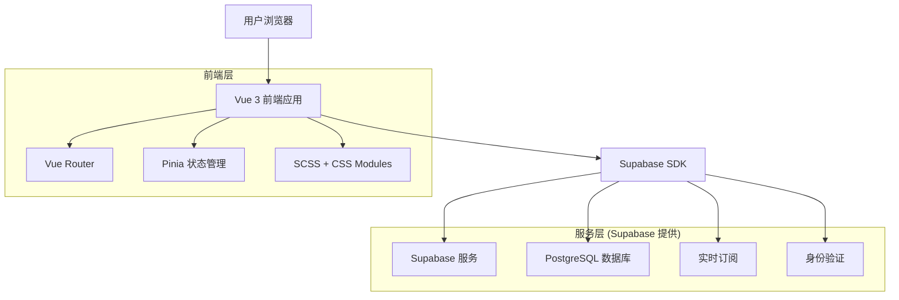
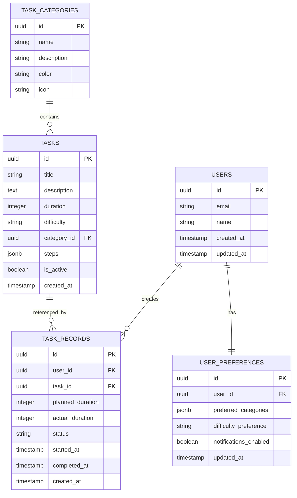

# 碎片时间管理器 - 技术架构文档

## 1. 架构设计



## 2. 技术描述

* **前端**: Vue 3 (组合式 API) + Vue Router 4 + Pinia + SCSS + CSS Modules + Vite

* **后端**: Supabase (PostgreSQL + 实时功能 + 身份验证)

* **状态管理**: Pinia

* **样式方案**: SCSS + CSS Modules (BEM 命名规范)

* **构建工具**: Vite

## 2.1 CSS 架构设计

### 样式组织结构

```
src/
├── styles/
│   ├── base/
│   │   ├── _reset.scss          # CSS 重置
│   │   ├── _variables.scss      # 全局变量
│   │   └── _typography.scss     # 字体样式
│   ├── components/
│   │   ├── _button.scss         # 按钮组件样式
│   │   ├── _card.scss           # 卡片组件样式
│   │   └── _timer.scss          # 计时器组件样式
│   ├── layout/
│   │   ├── _header.scss         # 头部布局
│   │   ├── _sidebar.scss        # 侧边栏布局
│   │   └── _grid.scss           # 网格系统
│   ├── pages/
│   │   ├── _home.scss           # 首页样式
│   │   ├── _timer.scss          # 计时器页面样式
│   │   └── _history.scss        # 历史记录页面样式
│   ├── utils/
│   │   ├── _mixins.scss         # 混入函数
│   │   └── _functions.scss      # 工具函数
│   └── main.scss                # 主样式文件
```

### CSS 命名规范 (BEM)

```scss
// 块 (Block)
.timer-card { }

// 元素 (Element)
.timer-card__title { }
.timer-card__content { }
.timer-card__button { }

// 修饰符 (Modifier)
.timer-card--active { }
.timer-card__button--primary { }
.timer-card__button--disabled { }
```

### 响应式设计断点

```scss
// _variables.scss
$breakpoints: (
  mobile: 320px,
  tablet: 768px,
  desktop: 1024px,
  large: 1200px
);

// 混入函数
@mixin respond-to($breakpoint) {
  @media (min-width: map-get($breakpoints, $breakpoint)) {
    @content;
  }
}
```

## 3. 路由定义

| 路由             | 用途              |
| -------------- | --------------- |
| /              | 首页，显示时间选择器和任务推荐 |
| /task/:id      | 任务详情页，显示具体任务信息  |
| /timer/:taskId | 倒计时页面，执行任务倒计时   |
| /history       | 历史记录页，显示完成的任务统计 |
| /settings      | 用户设置页，个人偏好和账户管理 |
| /login         | 登录页面，用户身份验证     |
| /register      | 注册页面，新用户注册      |

## 4. API 定义 (Supabase 数据库操作)

### 4.1 核心数据操作

**任务查询**

```typescript
// 根据精确时间长度获取推荐任务
const getRecommendedTasks = async (duration: number) => {
  const { data, error } = await supabase
    .from('tasks')
    .select(`
      *,
      task_categories (
        name,
        color,
        icon
      )
    `)
    .eq('duration', duration)
    .eq('is_active', true)
    .limit(6);
}
```

**任务记录创建**

```typescript
// 创建任务完成记录
const createTaskRecord = async (taskRecord: TaskRecord) => {
  const { data, error } = await supabase
    .from('task_records')
    .insert([taskRecord]);
}
```

**用户偏好更新**

```typescript
// 更新用户偏好设置
const updateUserPreferences = async (userId: string, preferences: UserPreferences) => {
  const { data, error } = await supabase
    .from('user_preferences')
    .upsert({ user_id: userId, ...preferences });
}
```

## 5. 数据模型

### 5.1 数据模型定义



### 5.2 数据定义语言

**用户表 (users)**

```sql
-- 用户表由 Supabase Auth 自动管理，扩展用户信息表
CREATE TABLE user_profiles (
    id UUID PRIMARY KEY REFERENCES auth.users(id) ON DELETE CASCADE,
    name VARCHAR(100) NOT NULL,
    avatar_url TEXT,
    created_at TIMESTAMP WITH TIME ZONE DEFAULT NOW(),
    updated_at TIMESTAMP WITH TIME ZONE DEFAULT NOW()
);

-- 启用行级安全策略
ALTER TABLE user_profiles ENABLE ROW LEVEL SECURITY;

-- 用户只能访问自己的资料
CREATE POLICY "Users can view own profile" ON user_profiles
    FOR SELECT USING (auth.uid() = id);

CREATE POLICY "Users can update own profile" ON user_profiles
    FOR UPDATE USING (auth.uid() = id);
```

**任务分类表 (task\_categories)**

```sql
CREATE TABLE task_categories (
    id UUID PRIMARY KEY DEFAULT gen_random_uuid(),
    name VARCHAR(50) NOT NULL,
    description TEXT,
    color VARCHAR(7) DEFAULT '#3B82F6',
    icon VARCHAR(50) DEFAULT 'clock',
    created_at TIMESTAMP WITH TIME ZONE DEFAULT NOW()
);

-- 允许匿名用户查看任务分类
GRANT SELECT ON task_categories TO anon;
GRANT ALL PRIVILEGES ON task_categories TO authenticated;

-- 初始化任务分类数据
INSERT INTO task_categories (name, description, color, icon) VALUES
('学习', '知识学习和技能提升', '#10B981', 'book'),
('运动', '身体锻炼和健康活动', '#F59E0B', 'activity'),
('创作', '写作、绘画等创意活动', '#8B5CF6', 'edit'),
('整理', '环境整理和物品归纳', '#6B7280', 'folder'),
('冥想', '放松和心理调节', '#06B6D4', 'heart');
```

**任务表 (tasks)**

```sql
CREATE TABLE tasks (
    id UUID PRIMARY KEY DEFAULT gen_random_uuid(),
    title VARCHAR(200) NOT NULL,
    description TEXT NOT NULL,
    duration INTEGER NOT NULL CHECK (duration > 0 AND duration <= 120),
    difficulty VARCHAR(20) DEFAULT 'medium' CHECK (difficulty IN ('easy', 'medium', 'hard')),
    category_id UUID REFERENCES task_categories(id) ON DELETE SET NULL,
    steps JSONB DEFAULT '[]',
    is_active BOOLEAN DEFAULT true,
    created_at TIMESTAMP WITH TIME ZONE DEFAULT NOW()
);

-- 创建索引
CREATE INDEX idx_tasks_duration ON tasks(duration);
CREATE INDEX idx_tasks_category ON tasks(category_id);
CREATE INDEX idx_tasks_difficulty ON tasks(difficulty);

-- 权限设置
GRANT SELECT ON tasks TO anon;
GRANT ALL PRIVILEGES ON tasks TO authenticated;

-- 初始化任务数据
INSERT INTO tasks (title, description, duration, difficulty, category_id, steps) VALUES
('快速阅读', '阅读一篇短文章或博客', 10, 'easy', 
 (SELECT id FROM task_categories WHERE name = '学习'), 
 '["选择感兴趣的文章", "专注阅读", "记录要点"]'),
('桌面整理', '整理工作桌面和文件', 15, 'easy',
 (SELECT id FROM task_categories WHERE name = '整理'),
 '["清理桌面杂物", "整理文件分类", "擦拭桌面"]');
```

**任务记录表 (task\_records)**

```sql
CREATE TABLE task_records (
    id UUID PRIMARY KEY DEFAULT gen_random_uuid(),
    user_id UUID REFERENCES auth.users(id) ON DELETE CASCADE NOT NULL,
    task_id UUID REFERENCES tasks(id) ON DELETE SET NULL,
    planned_duration INTEGER NOT NULL,
    actual_duration INTEGER,
    status VARCHAR(20) DEFAULT 'started' CHECK (status IN ('started', 'paused', 'completed', 'cancelled')),
    started_at TIMESTAMP WITH TIME ZONE DEFAULT NOW(),
    completed_at TIMESTAMP WITH TIME ZONE,
    created_at TIMESTAMP WITH TIME ZONE DEFAULT NOW()
);

-- 创建索引
CREATE INDEX idx_task_records_user_id ON task_records(user_id);
CREATE INDEX idx_task_records_created_at ON task_records(created_at DESC);
CREATE INDEX idx_task_records_status ON task_records(status);

-- 启用行级安全策略
ALTER TABLE task_records ENABLE ROW LEVEL SECURITY;

-- 用户只能访问自己的任务记录
CREATE POLICY "Users can manage own task records" ON task_records
    FOR ALL USING (auth.uid() = user_id);

GRANT SELECT, INSERT, UPDATE ON task_records TO authenticated;
```

**用户偏好表 (user\_preferences)**

```sql
CREATE TABLE user_preferences (
    id UUID PRIMARY KEY DEFAULT gen_random_uuid(),
    user_id UUID REFERENCES auth.users(id) ON DELETE CASCADE UNIQUE NOT NULL,
    preferred_categories JSONB DEFAULT '[]',
    difficulty_preference VARCHAR(20) DEFAULT 'medium' CHECK (difficulty_preference IN ('easy', 'medium', 'hard')),
    notifications_enabled BOOLEAN DEFAULT true,
    updated_at TIMESTAMP WITH TIME ZONE DEFAULT NOW()
);

-- 启用行级安全策略
ALTER TABLE user_preferences ENABLE ROW LEVEL SECURITY;

-- 用户只能访问自己的偏好设置
CREATE POLICY "Users can manage own preferences" ON user_preferences
    FOR ALL USING (auth.uid() = user_id);

GRANT SELECT, INSERT, UPDATE ON user_preferences TO authenticated;
```

